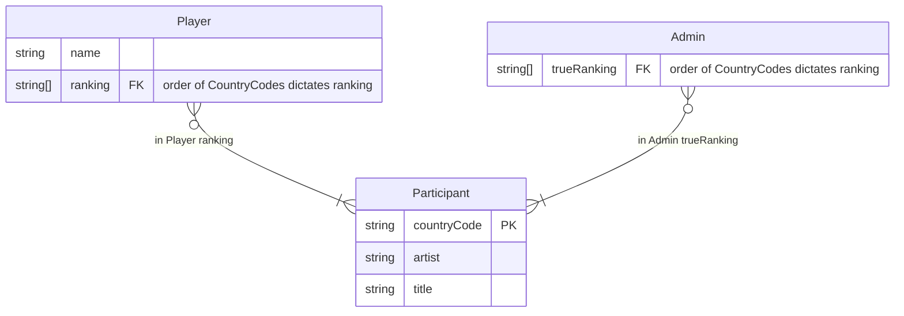
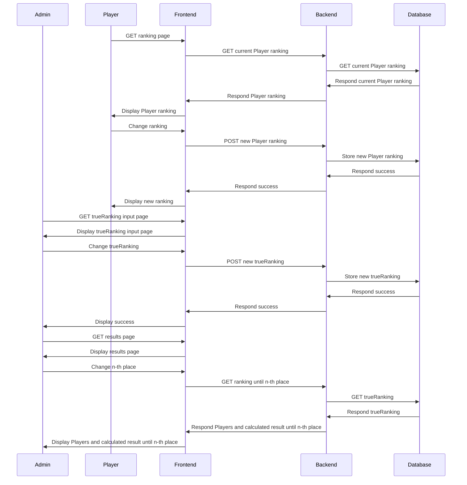

# esc_ranking

```mermaid
erDiagram
    Participant {
        string countryCode PK
        string artist
        string title
    }
    Player {
        string name
        string[] ranking FK "order of CountryCodes dictates ranking"
    }
    Admin {
        string[] trueRanking FK "order of CountryCodes dictates ranking"
    }

    Player }o--|{ Participant : "in Player ranking"
    Admin }o--|{ Participant : "in Admin trueRanking"
```

```mermaid
sequenceDiagram
    participant Admin
    participant Player
    participant Frontend
    participant Backend
    participant Database

    Player ->> Frontend : GET ranking page
    Frontend ->> Backend : GET current Player ranking
    Backend ->> Database : GET current Player ranking
    Database ->> Backend : Respond current Player ranking
    Backend ->> Frontend : Respond Player ranking
    Frontend ->> Player : Display Player ranking

    Player ->> Frontend : Change ranking
    Frontend ->> Backend : POST new Player ranking
    Backend ->> Database : Store new Player ranking
    Database ->> Backend : Respond success
    Backend ->> Frontend : Respond success 
    Frontend ->> Player : Display new ranking

    Admin ->> Frontend : GET trueRanking input page
    Frontend ->> Admin : Display trueRanking input page

    Admin ->> Frontend : Change trueRanking
    Frontend ->> Backend : POST new trueRanking
    Backend ->> Database : Store new trueRanking
    Database ->> Backend : Respond success
    Backend ->> Frontend : Respond success
    Frontend ->> Admin : Display success

    Admin ->> Frontend : GET results page
    Frontend ->> Admin : Display results page

    Admin ->> Frontend : Change n-th place
    Frontend ->> Backend : GET ranking until n-th place
    Backend ->> Database : GET trueRanking
    Database ->> Backend : Respond trueRanking
    Backend ->> Frontend : Respond Players and calculated result until n-th place
    Frontend ->> Admin : Display Players and calculated result until n-th place

```